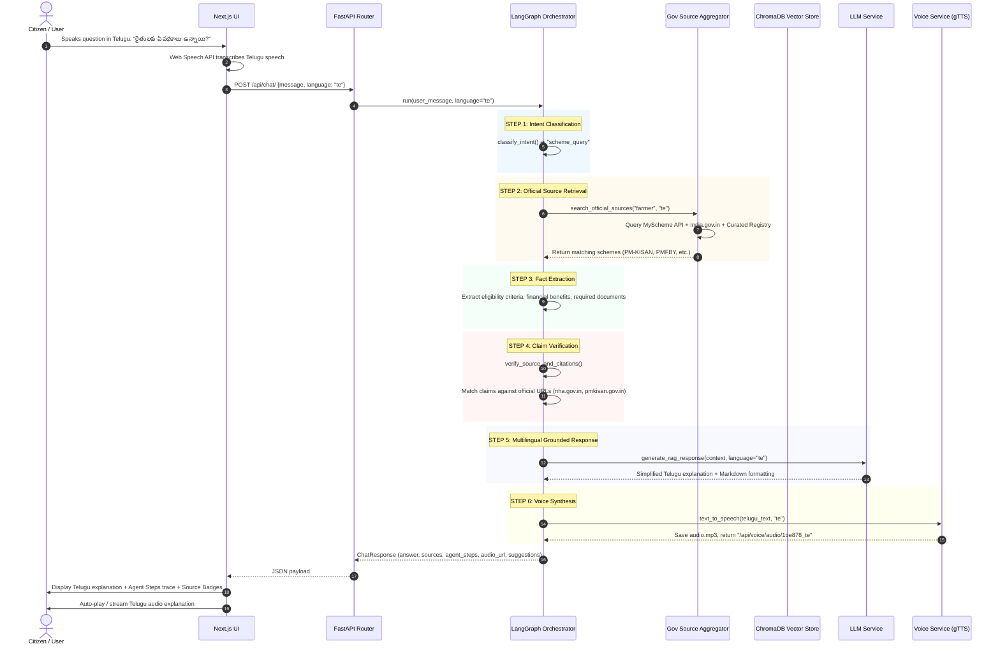
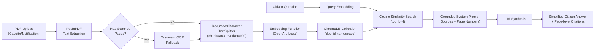

# JanSahayak AI — System Architecture & Workflow Diagrams

## 1. High-Level System Architecture

```mermaid
flowchart TD
    subgraph Client["Frontend Client (Next.js 14 + React 18 + Tailwind)"]
        UI_Home["Landing Page /"]
        UI_Assistant["AI Assistant /assistant"]
        UI_Schemes["Scheme Explorer /schemes"]
        UI_Eligibility["Eligibility Wizard /eligibility"]
        UI_Documents["Document Analyzer /documents"]
        UI_About["About & Sources /about"]
        
        STT["Web Speech API (STT)"]
        AudioPlayer["HTML5 Audio Player (TTS)"]
    end

    subgraph API_Gateway["FastAPI Gateway (Port 8000)"]
        CORS["CORS Middleware"]
        Lifespan["Lifecycle Manager"]
        
        Router_Chat["/api/chat"]
        Router_Schemes["/api/schemes"]
        Router_Eligibility["/api/eligibility"]
        Router_Documents["/api/documents"]
        Router_Voice["/api/voice"]
    end

    subgraph Agent_Core["Agentic AI Orchestrator (LangGraph)"]
        Graph["Directed StateGraph (9 Nodes)"]
        Intent["1. Classify Intent"]
        Retrieve["2. Retrieve Information"]
        Extract["3. Extract Key Facts"]
        Evaluate["4. Evaluate Eligibility"]
        Verify["5. Verify Claims & Citations"]
        Generate["6. Generate Response"]
        Suggest["7. Follow-up Suggestions"]
        Audio["8. Audio Synthesis"]
    end

    subgraph Services["Core Backend Services"]
        LLM_Service["LLMService (OpenAI / Provider-Abstracted)"]
        Gov_Aggregator["GovernmentSourceAggregator"]
        Doc_Service["DocumentService (PyMuPDF + OCR)"]
        Voice_Service["VoiceService (gTTS + File Cache)"]
    end

    subgraph Data_Stores["Data & Storage Layer"]
        Chroma["ChromaDB Vector Store (Local Persistent)"]
        AudioCache["Audio Cache (/audio_cache/*.mp3)"]
        UploadStore["Upload Store (/uploads/*.pdf)"]
    end

    subgraph External_Sources["Official External Government Portals"]
        MyScheme["MyScheme API (api.myscheme.gov.in)"]
        IndiaGov["India.gov.in Portal"]
        DataGov["Data.gov.in (CKAN Open Data API)"]
        Flagship["Curated Flagship Schemes Registry"]
    end

    %% Client to API
    UI_Assistant --> Router_Chat
    UI_Schemes --> Router_Schemes
    UI_Eligibility --> Router_Eligibility
    UI_Documents --> Router_Documents
    STT --> Router_Chat
    Router_Voice --> AudioPlayer

    %% API to Agent
    Router_Chat --> Graph
    Router_Eligibility --> Evaluate
    Router_Schemes --> Gov_Aggregator
    Router_Documents --> Doc_Service

    %% Agent Internal Flow
    Intent --> Retrieve
    Retrieve --> Extract
    Extract --> Evaluate
    Evaluate --> Verify
    Verify --> Generate
    Generate --> Suggest
    Suggest --> Audio

    %% Agent to Services
    Retrieve --> Gov_Aggregator
    Extract --> Doc_Service
    Generate --> LLM_Service
    Audio --> Voice_Service

    %% Services to Data
    Doc_Service --> Chroma
    Doc_Service --> UploadStore
    Voice_Service --> AudioCache
    Gov_Aggregator --> MyScheme
    Gov_Aggregator --> IndiaGov
    Gov_Aggregator --> DataGov
    Gov_Aggregator --> Flagship
```

---

## 2. Agentic Workflow Execution Sequence

```mermaid
sequenceDiagram
    autonumber
    actor Citizen as Citizen / User
    participant Frontend as Next.js UI
    participant FastAPI as FastAPI Router
    participant Orchestrator as LangGraph Orchestrator
    participant GovSources as Gov Source Aggregator
    participant Chroma as ChromaDB Vector Store
    participant LLM as LLM Service
    participant TTS as Voice Service (gTTS)

    Citizen->>Frontend: Speaks question in Telugu: "రైతులకు ఏ పథకాలు ఉన్నాయి?"
    Frontend->>Frontend: Web Speech API transcribes Telugu speech
    Frontend->>FastAPI: POST /api/chat/ {message, language: "te"}
    FastAPI->>Orchestrator: run(user_message, language="te")

    rect rgb(240, 248, 255)
        Note over Orchestrator: STEP 1: Intent Classification
        Orchestrator->>Orchestrator: classify_intent() ➔ "scheme_query"
    end

    rect rgb(255, 250, 240)
        Note over Orchestrator: STEP 2: Official Source Retrieval
        Orchestrator->>GovSources: search_official_sources("farmer", "te")
        GovSources->>GovSources: Query MyScheme API + India.gov.in + Curated Registry
        GovSources-->>Orchestrator: Return matching schemes (PM-KISAN, PMFBY, etc.)
    end

    rect rgb(245, 255, 250)
        Note over Orchestrator: STEP 3: Fact Extraction
        Orchestrator->>Orchestrator: Extract eligibility criteria, financial benefits, required documents
    end

    rect rgb(255, 245, 245)
        Note over Orchestrator: STEP 4: Claim Verification
        Orchestrator->>Orchestrator: verify_source_and_citations()
        Orchestrator->>Orchestrator: Match claims against official URLs (nha.gov.in, pmkisan.gov.in)
    end

    rect rgb(248, 248, 255)
        Note over Orchestrator: STEP 5: Multilingual Grounded Response
        Orchestrator->>LLM: generate_rag_response(context, language="te")
        LLM-->>Orchestrator: Simplified Telugu explanation + Markdown formatting
    end

    rect rgb(255, 255, 240)
        Note over Orchestrator: STEP 6: Voice Synthesis
        Orchestrator->>TTS: text_to_speech(telugu_text, "te")
        TTS-->>Orchestrator: Save audio.mp3, return "/api/voice/audio/1be878_te"
    end

    Orchestrator-->>FastAPI: ChatResponse (answer, sources, agent_steps, audio_url, suggestions)
    FastAPI-->>Frontend: JSON payload
    Frontend->>Citizen: Display Telugu explanation + Agent Steps trace + Source Badges
    Frontend->>Citizen: Auto-play / stream Telugu audio explanation
```

---

## 3. RAG Pipeline (Document Analyzer)

```mermaid
flowchart LR
    Upload["PDF Upload\n(Gazette/Notification)"] --> Parse["PyMuPDF\nText Extraction"]
    Parse --> OCR{"Has Scanned\nPages?"}
    OCR -- Yes --> Tesseract["Tesseract OCR\nFallback"]
    OCR -- No --> Chunker["RecursiveCharacter\nTextSplitter\n(chunk=800, overlap=100)"]
    Tesseract --> Chunker
    Chunker --> Embed["Embedding Function\n(OpenAI / Local)"]
    Embed --> Index["ChromaDB Collection\n(doc_id namespace)"]

    Query["Citizen Question"] --> QueryEmbed["Query Embedding"]
    QueryEmbed --> Search["Cosine Similarity Search\n(top_k=4)"]
    Index --> Search
    Search --> Grounded["Grounded System Prompt\n(Sources + Page Numbers)"]
    Grounded --> LLM["LLM Synthesis"]
    LLM --> Result["Simplified Citizen Answer\n+ Page-level Citations"]
```
